<div align="center">
  
  <h1 align="center">Snake and Ladders</h1>
</div>

<h2>Check it our at: https://onlinegdb.com/ET9BAXBIJ</h2>

## About Snakes and Ladder:
Snakes and ladders is a board game for two or more players regarded today as a worldwide classic. The game originated in ancient India as Moksha Patam, and was brought to the UK in the 1890s. It is played on a game board with numbered, gridded squares.

## Screen Shots:
<div align="center">
  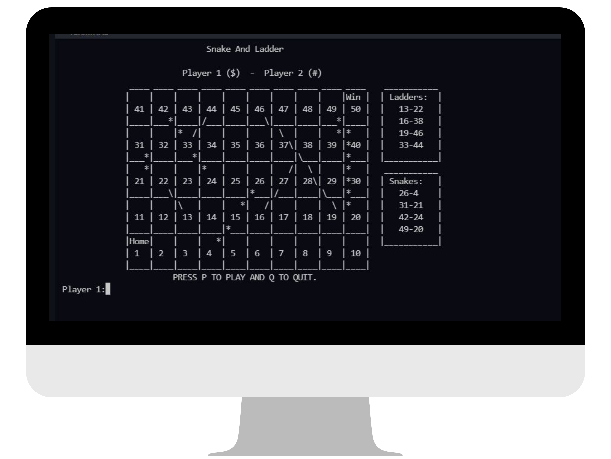
  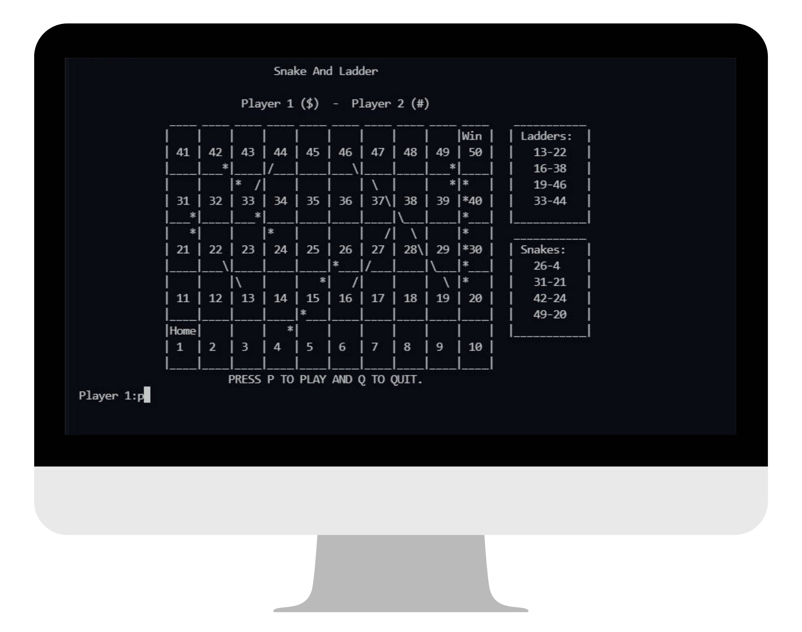
  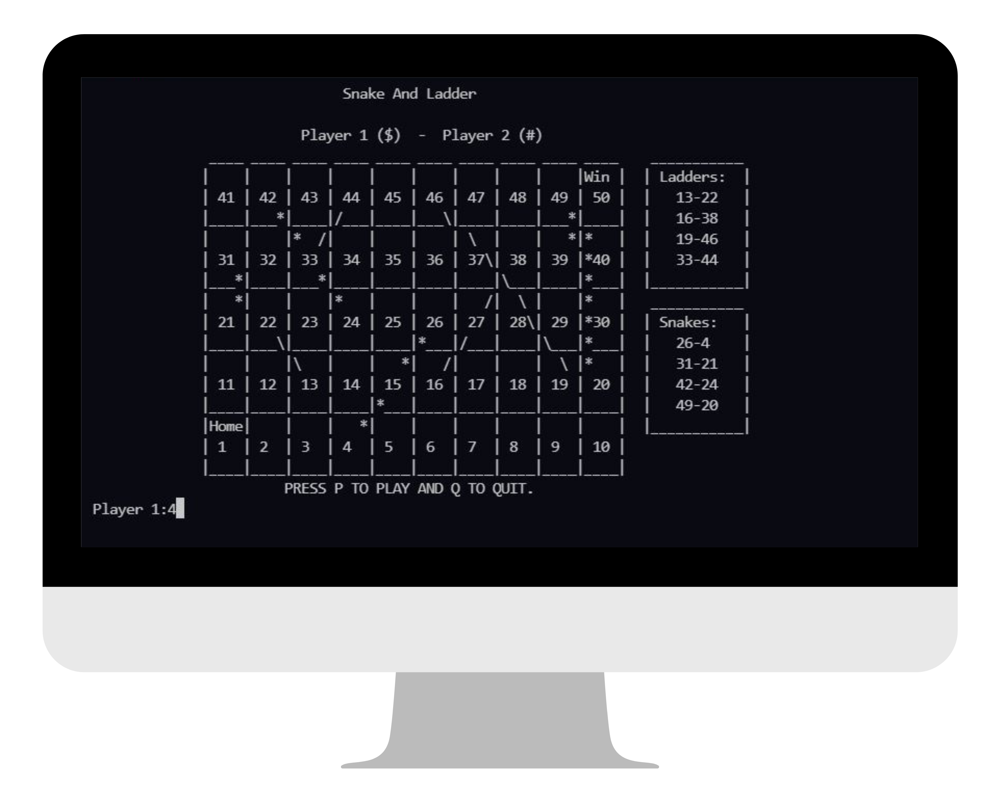
  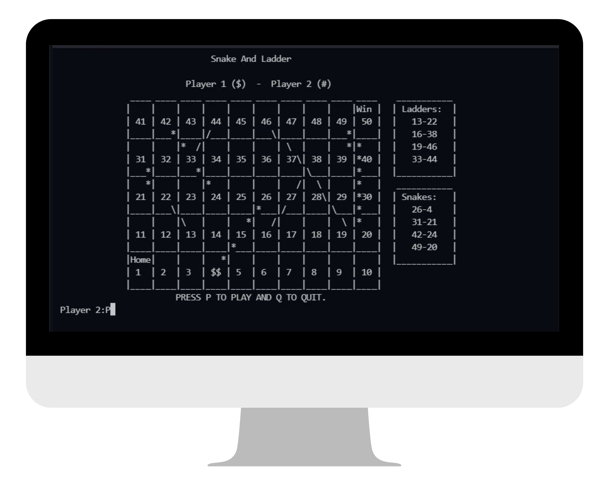
  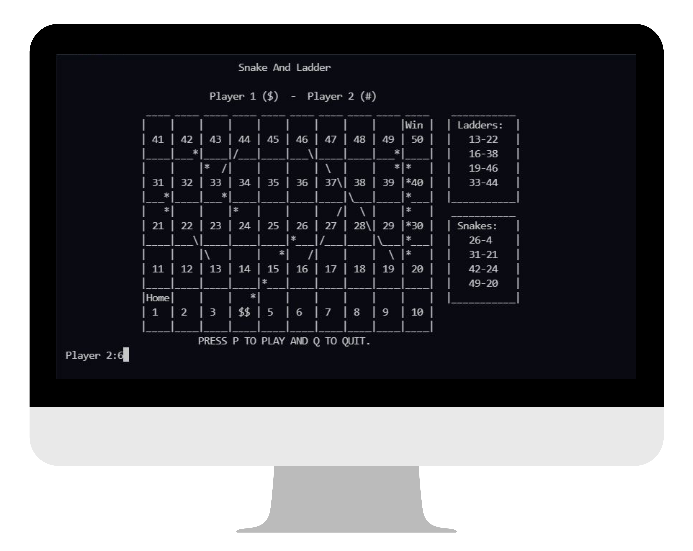
  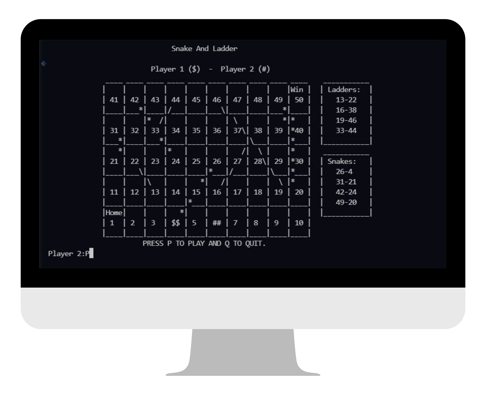
  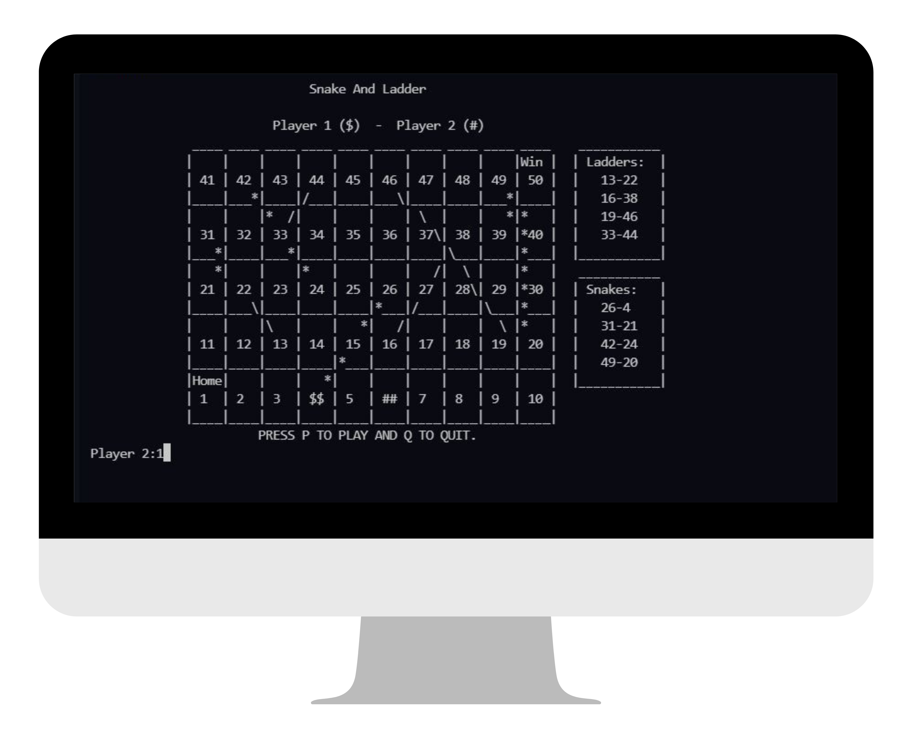
  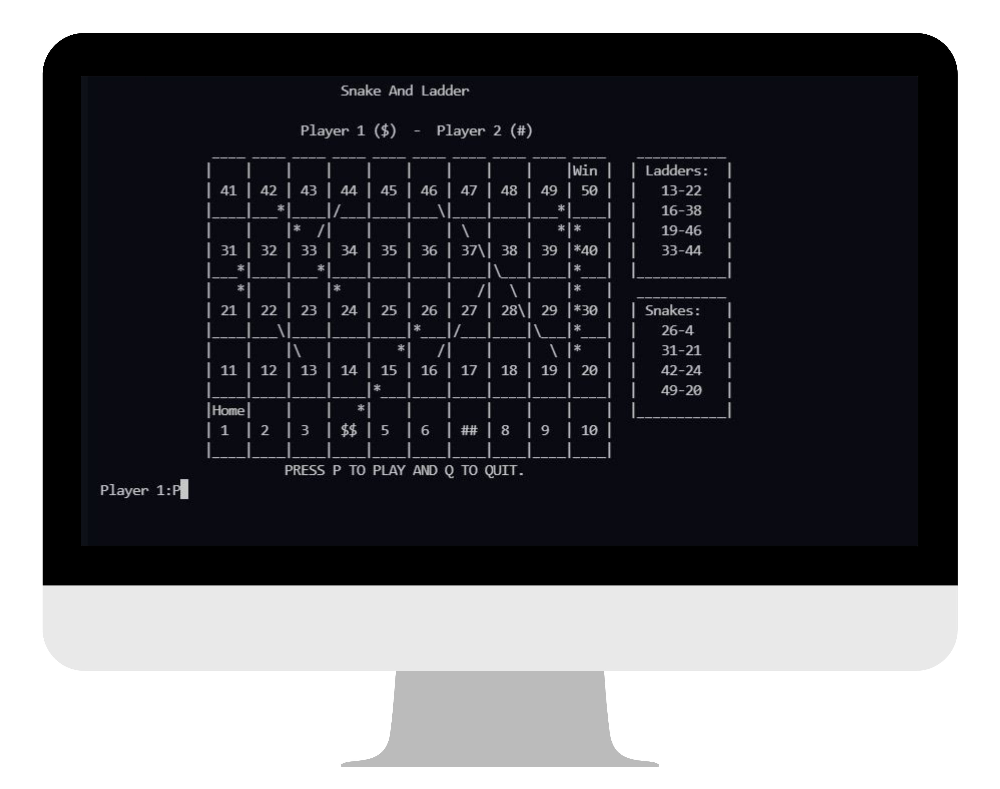
  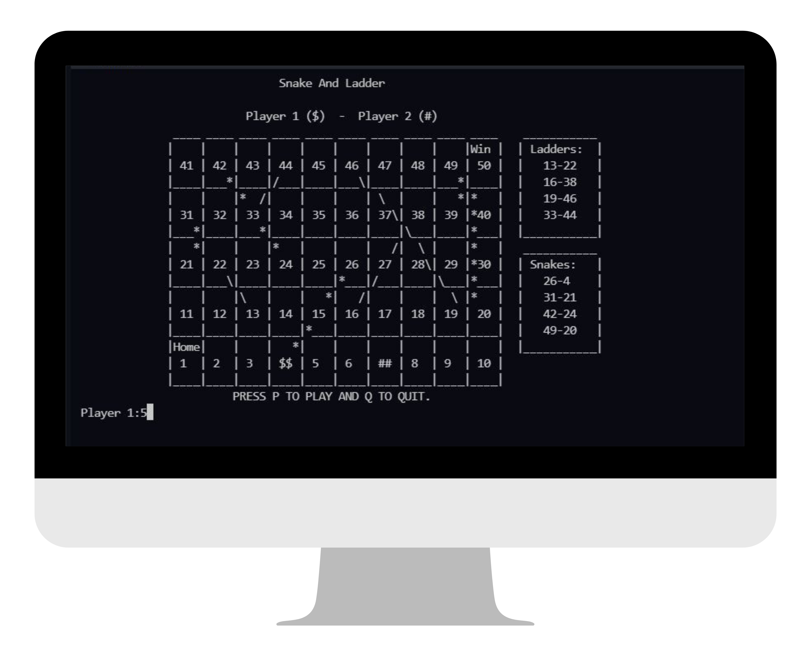
  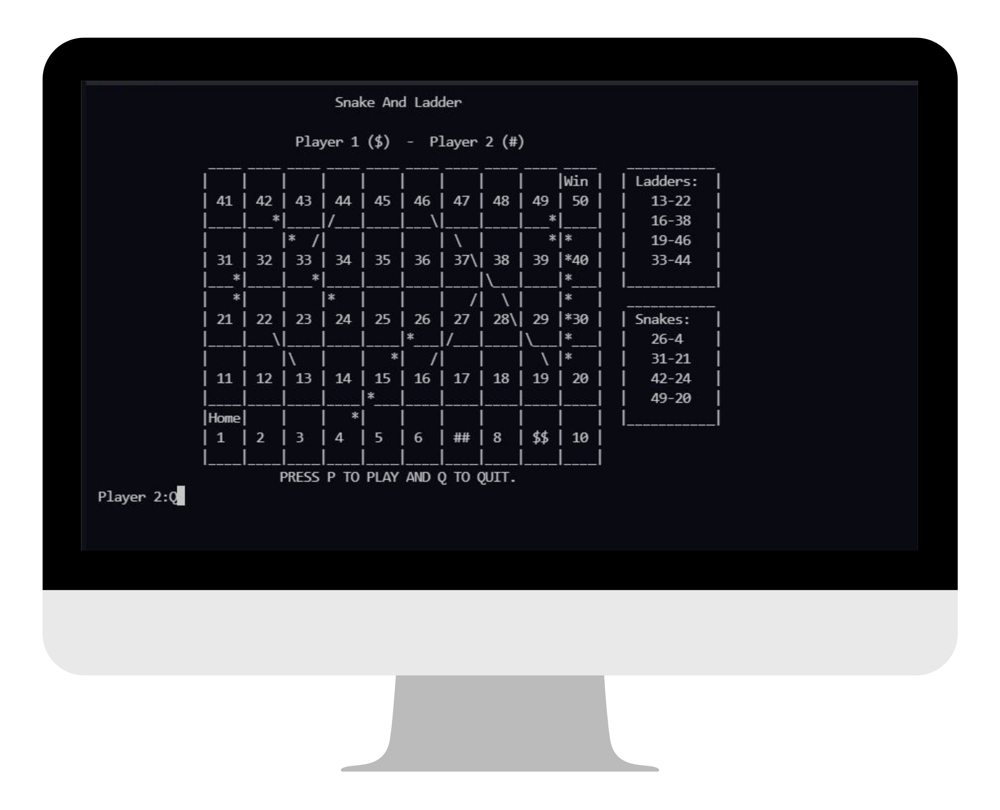
  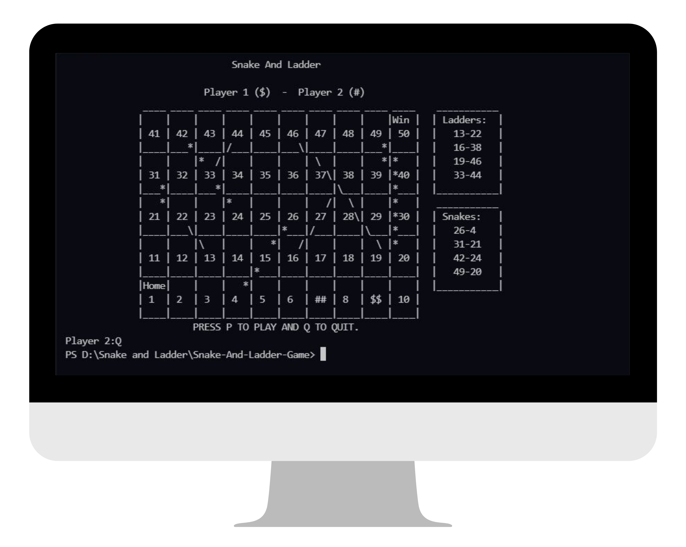
</div>

### Steps to Run on Local Machine

***

#### Note: You need to have C++ compiler installed in your local Machine for Successfully running the code. <a href="https://sourceforge.net/projects/mingw/">Install MinGW </a>
##### Step 1) Clone AmanSinghBhogal/Snake-And-Ladder-Game.
##### Step 2) Open Snake-And-Ladder-Game cloned Directory in Command Prompt and run the following command:
```
gcc Snake_ladder.cpp -o Snake_ladder
```
#### Step 3) Next, Run the following Command (it will execute the previously compiled file):
```
./Snake_ladder
```

***

<h1 align="center">Thank You</h1>

***